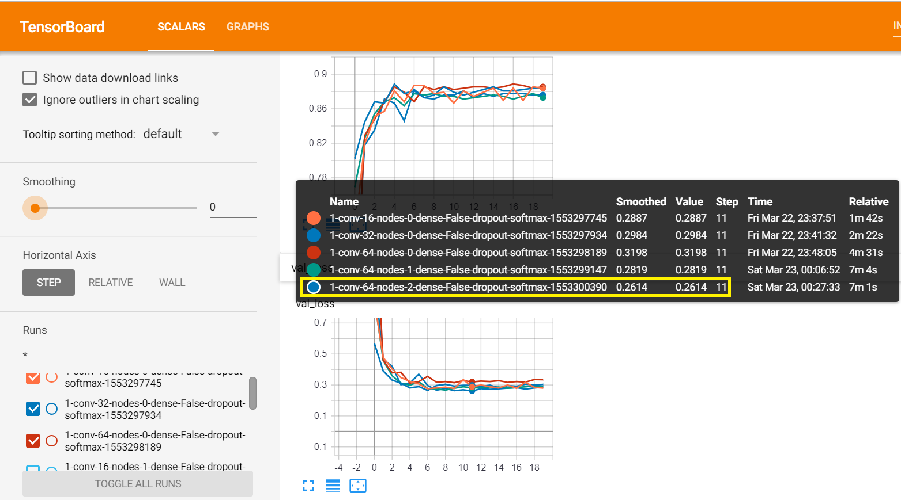

## Multi-Class Classification with Machine Learning and Deep Learning
This is a project to sharpen my knowledge in the following technologies :
- Python and Jupyter Notebooks
- Data Science librairies (Pandas and Numpy)
- Machine Learning and Deep Learning frameworks (Scikit-Learn and Keras using Tensorflow as backend)
- TensorBoard for Deep Learning model optimisation

As expected, the experiment demonstrates that Deep Learning is significantly more effective for image analysis compared to traditional Machine Learning algorithms.

This project is decomposed in 4 steps :

##### 1. Pre-process raw training images
The current product images are raw, unformatted pixel data. Before the images can be used to train a custom model, the image data needs preprocessing to create new pixel data in a normalised, clean format, so that images are comparable within the dataset.
In our case, we transform all images to a particular format: 128x128x1 pixels and ensure that the pixel range is [0,255] by applying an equalising function.

The dataset data was then converted the numpy arrays and saved as pickle files - The image data (features) is saved as X.pickle while the associated categories (labels) are saved as y.pickle)

[Download training images (raw format)](https://gbourniquestorage.blob.core.windows.net/shared/gear_images.zip)

[Download Features as Numpy Array](https://gbourniquestorage.blob.core.windows.net/shared/X.pickle)

[Download Labels as Numpy Array](https://gbourniquestorage.blob.core.windows.net/shared/y.pickle)
    
##### 2. Training and comparison of two mutli-class classifiers with Scikit-Learn
In this notebook, two multi-class classification algorithms are explored, in order to predict the category of outdoor gear equipment. The model training step is performed on the equalised 128x128x3 gear data from the previous step. The SVM model achieve a 80% accuracy and appears to be more effective than the Decision Tree algorithm.

##### 3.1 Training of a Deep Learning multi-class classifier with Keras
In this step, the goal is to try Deep Learning to conclude if the accuracy of the image classification improves, as Deep Learning and CNNs tend to perform well for complex data such as image. This CNN model with "default" parameters achieves an accuracy of 86% and is more performant than the SVM model.

[Download CNN model](https://gbourniquestorage.blob.core.windows.net/shared/64x2-CNN.model)

##### 3.2 Optimising the CNN Model with TensorBoard
The purpose of this Notebook is to train a number of alternative models by changing some basics parameters of the architecture, such as the number of Convolutional Layers, nodes per layer, and dense layers. The Log Dir callback of TensorBoard allows to identify the best model and at which epoch the highest performances is achieved. 

Among the evaluated models, the lowest validation loss was achieved by a model with 1 Convolutional layer, 64 Nodes per layer, and 2 Dense layers, as shown in the following image. This was kept as the best model so far.

[Download best CNN model](https://gbourniquestorage.blob.core.windows.net/shared/64x1-2-CNN.model)

##### 4. Using the Deep Learning model to predict the category of new unseen (out of sample) image data
Finally, we can use the model created in the previous step and predict the class of new out of samples images. They will go through the same pre-processing steps before being fed into the classification model.

[Download out of sample images](https://gbourniquestorage.blob.core.windows.net/shared/out-of-sample-images.zip)
